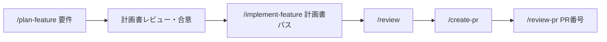

# Claude Code ワークフローガイド

kabu-dash の開発で Claude Code を活用するためのワークフロー・コマンド・エージェントの一覧。
各コマンド・エージェントの詳細な動作は `.claude/commands/` `.claude/agents/` の各ファイルが正。
アーキテクチャ・テスト方針は [architecture.md](./architecture.md) を参照。

---

## スラッシュコマンド一覧

| コマンド | 用途 | 例 |
|---------|------|-----|
| `/plan-feature <要件>` | 実装計画を作成し `docs/plans/` に保存（コードは変更しない） | `/plan-feature 銘柄をポートフォリオに追加できる` |
| `/implement-feature <計画書パス>` | 計画に基づき実装+テスト。カバレッジ100%まで完了しない | `/implement-feature docs/plans/2026-07-02-add-stock.md` |
| `/investigate <機能名>` | 既存機能を調査し Mermaid 図付きレポートを `docs/investigations/` に保存 | `/investigate 銘柄一覧画面` |
| `/refactor <対象>` | テストを安全網に振る舞いを変えないリファクタリング | `/refactor src/app/Http/Controllers/StockController.php` |
| `/ddd-model <要件>` | DDD ドメインモデルを設計 | `/ddd-model ポートフォリオ管理機能` |
| `/ddd-implement <集約名>` | DDD モデルをコード+テストとして実装 | `/ddd-implement Stock集約` |
| `/review [対象]` | 変更差分 or 指定ファイルをレビュー | `/review` |
| `/review-pr <PR番号>` | GitHub PR をレビュー | `/review-pr 42` |
| `/create-pr [タイトル]` | 品質ゲート確認後にコミット・push し GitHub PR を作成 | `/create-pr ローカル環境のHTTPS化` |
| `/test [フィルタ\|--coverage]` | テスト実行。`--coverage` でカバレッジ計測（100%必須） | `/test --coverage` |
| `/lint [--fix]` | Pint で規約チェック。`--fix` で自動修正 | `/lint --fix` |

## エージェント一覧

| エージェント | 役割 | 主な呼び出し元 |
|-------------|------|--------------|
| `code-explorer` | 既存コード調査（読み取り専用・Mermaid図付き定型レポート） | `/investigate` `/plan-feature` |
| `ddd-modeler` | ドメインモデル設計（ユビキタス言語・集約・値オブジェクト） | `/ddd-model` `/plan-feature` |
| `ddd-implementer` | DDD モデルの実装（コード+テスト生成） | `/ddd-implement` `/implement-feature` |
| `test-writer` | テスト作成・カバレッジ100%達成の専門家 | `/implement-feature` `/refactor` |
| `reviewer` | コードレビュー（セキュリティ・バグ・テスト・規約・性能） | `/review` `/review-pr` |

## 開発ワークフロー

### 機能追加（計画→実装→レビュー）



1. `/plan-feature {要件}` — 計画書が `docs/plans/` に保存される
2. 計画書を確認し、必要なら対話で修正
3. `/implement-feature {計画書パス}` — テスト込みで実装（pint・テスト・カバレッジ100%がゲート）
4. `/review` → `/create-pr` で PR 作成 → `/review-pr {PR番号}`

### 既存機能の調査

```
/investigate {機能名・画面名}
→ docs/investigations/ にシーケンス図・クラス図・ER図付きレポートが保存される
```

### リファクタリング

```
/refactor {ファイル・ディレクトリ・機能名}
→ テストのグリーン確認 →（カバレッジ不足なら先にテスト追加）→ 小さく変更 → テスト・カバレッジで完了確認
```

### DDD 設計だけ先に行う場合

```
/ddd-model {要件} → 設計合意 → /ddd-implement {集約名} → /review
```

## 品質ゲート（全ワークフロー共通）

コード変更を伴う作業は以下がすべてパスして完了となる（CI でも強制）。

```bash
docker compose exec app ./vendor/bin/pint --test
docker compose exec app php artisan test
docker compose exec app php artisan test --coverage --min=100
```

## ファイル構成

```
.
├── CLAUDE.md                        # プロジェクト概要（Claude が自動読み込み）
├── docs/
│   ├── architecture.md              # アーキテクチャ・実装規約・テスト方針（唯一の正）
│   ├── claude-workflow.md           # このドキュメント
│   ├── plans/                       # /plan-feature の計画書
│   └── investigations/              # /investigate の調査レポート
└── .claude/
    ├── settings.json                # 共有permission設定
    ├── agents/
    │   ├── code-explorer.md
    │   ├── ddd-modeler.md
    │   ├── ddd-implementer.md
    │   ├── test-writer.md
    │   └── reviewer.md
    └── commands/
        ├── plan-feature.md
        ├── implement-feature.md
        ├── investigate.md
        ├── refactor.md
        ├── ddd-model.md
        ├── ddd-implement.md
        ├── review.md
        ├── review-pr.md
        ├── create-pr.md
        ├── test.md
        └── lint.md
```
